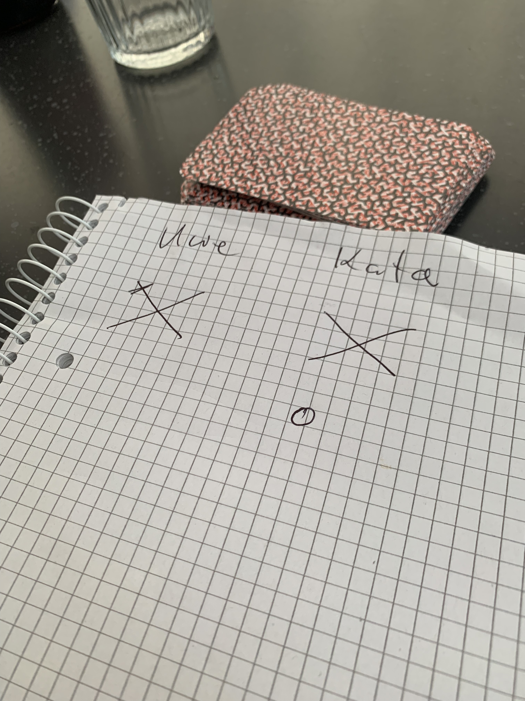

# tripleS
by ufe / 2023-07 for Syntax Inst.
```
 _____     _       _      ____
|_   _| __(_)_ __ | | ___/ ___|
  | || '__| | '_ \| |/ _ \___ \
  | || |  | | |_) | |  __/___) |
  |_||_|  |_| .__/|_|\___|____/
            |_|
```

# SpielStandSystem

---
Problem: ***Zettelwirtschaft*** beim Spielen so wie ***fehlende Klarheit** 
bei den Regeln
---
# 1. Mission Description
   Da bei uns in der Familie viel gespielt wird, gibt es immer wieder 
   Momente in denen wir die notwendigen Vordrucke für Spiele nicht 
   finden oder die Karten mit dem Ablauf des Spiels nicht in 
   aussreichender Zahl vorhanden sind. Hier galt es ein System zu 
   schaffen welches dieses Problem mit Hilfe moderner Computertechnik 
   zu lösen.
---
# 2. Design Goals
    * Beliebig viele Spieler
    * Beliebig viele Spiele (Durch Klassen einfach zum Spiel hinzuzufügen)
    * Beliebig viele Runden
    * Spielhistorie durch Abspeichern aller Spiele und Laden bei 
      Systemstart mit z.B. Jason (to do)
    * Export der Daten in CSV oÄ (to do)
    * Auswertungsmöglichkeiten über Spiele und Gesamt (to do)
    * Möglichst intuitive/unix like Bedieung
    * eingebauter Würfel
---
# 3. Implemented Games
# Jassen
[Folgende Informationen sind zum Teil entnommen aus Wikipedia]
(https://de.wikipedia.org/wiki/Jass)  
*Die Farben der österreichischen Karten basieren auf dem einfachen
deutschen Blatt mit
Salzburger Bild und werden Herz, Schelle (auch Karo), Eichel (auch Kreuz) und Laub
(auch Pik, Gras oder Grün) genannt. Jede Farbe umfasst neun Karten: 6er (bei Schelle auch Weli genannt),
7er, 8er, 9er (bei Trumpf Nell), 10er, Unter (bei Trumpf Bauer; Liechtenstein: Under),
Ober, König und As (z. T. Sau).*


Wir spielen es mit 
Österreichisches Blatt  


mit vereinfachten Regeln:
  
es gibt 36 karten in 4 Farben:  
* Farbe:  
  - Herz   
  - Laub    
  - Schell  
  - Eichel  
* Karten:   
  - VI
  - VII
  - VIII
  - IX
  - X -- 10 punkte
  - Unter -- 2 (Farbe unten an der Figur auf der Karte)
  - Ober -- 3 (Farbe oben an der Figur auf der Karte)
  - König -- 4 
  - Ass -- 11

* bei Trumpf (erste aufgedeckte Karte)
  * --> Unter -- 20 Punkte  
  * IX -> Weli/Nell -> 14  
  * alle anderen bleiben gleich  

* wir starten mit 8 Karten
* man muss immer bedienen
* der Gewinner der Runde kann auf dem X(s.u.) eine der Ecken oder die 
  Mitte abstreichen
* wenn man in einer Runde unter 20 Punkte hat, bekommt man einen Sack,
  der mit einem Kreis unter dem X markiert wird
* durch einen Sieg kann man einen Sack streichen (sind also Minus Punkte)
* Auf dem X kann man 5 Siege markieren (jede Ecke und die Mitte), daher 
  ist der Erste, der fünf Siege hat Gesamtsieger, wenn er keinen Sack hat.

Ansicht einer anfgefangenen JASS Runde auf Papier


wir sehen hier: Uwe hat einen Punkt, kata einen Sack  
(Die Ausgabe ist zur Zeit leider nur mit Zahlen, das Ausdrucken des X 
mit Kotlin auf der Konsole war dann schnell zu unübersichtlich und 
zeitraubend,siehe auch  [Challenges](#4-challenges))
----
   
# Kniffel
[Folgende Informationen sind zum Teil entnommen aus Wikipedia]
(https://de.wikipedia.org/wiki/Jass)


  
Kniffel oder Yahtzee ist ein Würfelspiel mit fünf Würfeln, einem Würfelbecher
und einem speziellen Spielblock. Das Spiel ist kommerziell erhältlich, wird
jedoch häufig ohne den vorgedruckten Block gespielt. Es leitet sich ab vom 
Escalero, einer südamerikanischen Form des Würfelpokers, und dem Yacht, ist
jedoch wesentlich jünger und wird mit herkömmlichen Spielwürfeln gespielt.
  
Im System ist der Standard Kniffelblock implementiert und sieht 
folgendermassen aus.
```
 Total
       Spieler       ufe      kata     Jakob
    nur einser         3         .         .
    nur zweier         .         3         .
    nur dreier         .         .         .
    nur vierer         .         .         5
    nur fünfer         .         .         .
    nur secher         .         .         .
--------------------------------------------
bonus bei > 63        00        00        00
gesamt oberer          3         3         5
--------------------------------------------
  dreier pasch         .         .         .
   viererpasch         .         .         .
    full house         .         .         .
kleine strasse         .         .         .
grosse strasse         .         .         .
       kniffel         .         .         .
        chance         .         .         .
--------------------------------------------
      endsumme         3         3         5
```
----
Phase 10 - Not implemented yet
----  

# 4. Challenges
 * Die Datenstruktur ist sehr unübersichtlich und nicht gut gewählt. Dies
beruht auf mangelnder Erfahrung mit Klassen sowie komplexen Datentypen 
aus Klassen in Klassen.
* Die Spielergebnisse werden in Mutablen Listen von Mutablen Listen 
  gespeichert. Die kalkulierten Zwischenergebnisse ebenfalls. Besonders 
  bei Kniffel muss es eine bessere Lösung geben, da sind die Daten für 
den Kniffelblock in einer linkedMap, und die Daten für die Ergebnisse 
  pro user in einer mutableMap abgelegt, und werden nur über den Index 
  identifiziert. Ich hätte mir da eine 2 dimensionale Tabelle mit Key, 
  String, int per User, int per user.. gewünscht. 
* Die Ausgabe der Ergebnisse in einer Konsole ist nicht gut gelöst.
  Ich kann nur reihenweise ausgeben, die Daten liegen aber alle in 
  Spalten vor. Daher muss die Ausgabe per Reihe immer alle 
  verschiedenen Spalten(Mutablen Listen)durchlaufen.
# 5. To be done
* Geplant war eine volle Historie über alle Spieler, Spiele und Spielzüge, 
  diese ist in den Datenstrukturen vorhanden und somit abrufbar, die 
  Methoden und 
  Menueeinträge sind aber noch nicht vorhanden.
* Abspeichern als .json oder anders ist ein Muss und noch nicht 
  implementiert. Es ist alles dafür vorgesehen, auch das 
  automatische Abspeichern der Daten bei einem Crash.
* Es gibt bis jetzt überhaupt keine Plausibilitäten (z.b. bei Kniffel 
  kann man bei Einsern 7 eingeben, obwohl das nicht würfeltechnisch 
  nicht geht, auch findet keine automatische Nummernwahl bei Full House.
  . statt)
* Das Spiel GGeneric tut nichts sinnvolles, war nur zum einfachen
  Testen der Mutter Klasse gedacht und kann aus den Menues entfernt
  werden.

# 8. Credits
   * thanks @Gordon Lukas for providing the wonderfull function that 
   reminds me of my Ansi C times: normalizeStringLeght, making a string 
   alway x character right-aligned
   * another thanks for the ASCII Text Stuff to 
```
     FIGlet Copyright (C) 1991-2012 Glenn Chappell, Ian Chai, John Cowan,
     Christiaan Keet and Claudio Matsuoka
     Internet: <info@figlet.org> Version: 2.2.5, date: 31 May 2012
```
# 8. Classes
```
class Dice
      var numberOfDices: Int = 2
      
      fun showDice() 
      fun setDiceNumber(numberOfDices: Int) 
      fun doDice() 
```
```
class User(var name: String)
    val uuid = UUID.randomUUID()
    val addTime = LocalDateTime.now()
    var aktivated: Boolean = true
    
    override fun toString(): String {
```
```
class Users 
    val uuid = UUID.randomUUID()
    var addTime = LocalDateTime.now()
    var usersList: MutableList<User> = mutableListOf<User>()

    override fun toString()
    fun commands(prompt: String) 
```
```
class TheTripleS 
   val uuid = UUID.randomUUID()
   var addTime = LocalDateTime.now()
   open var games: MutableList<Game> = mutableListOf<Game>()
   var users: Users = Users()
   var dice: Dice=Dice()
   
   fun doIt() 
```
```
class Game 
    val uuid = UUID.randomUUID()
    var addTime = LocalDateTime.now()
    var ergebnis: GGeneric = GGeneric()
    var users: MutableList<User> = mutableListOf<User>()
    var selectedGame: Int = 0
    var selectedUsers: Int = 0
    var started: Boolean = false
    var name: String = ""
    var runde: Int = 0
    var dice: Dice=Dice()

    override fun toString(): String {
    fun commands(prompt: String, usersInGame: Users) {
    fun listUsers() {
```
```
 __  __       _   _                  ____ _
|  \/  | ___ | |_| |__   ___ _ __   / ___| | __ _ ___ ___
| |\/| |/ _ \| __| '_ \ / _ \ '__| | |   | |/ _` / __/ __|
| |  | | (_) | |_| | | |  __/ |    | |___| | (_| \__ \__ \
|_|  |_|\___/ \__|_| |_|\___|_|     \____|_|\__,_|___/___/

open class GGeneric() 
    val uuid = UUID.randomUUID()
    var addTime = LocalDateTime.now()
    var listOfResults: MutableList<Int> = mutableListOf<Int>()
    var rundenZaehler: Int = 0

    open fun toString()
    open fun listRunde(spielers: MutableList<User>, prompt: String):
    open fun listGame(spielers: MutableList<User>, prompt: String) 
    open fun spielRunde()
    open fun isGameOver(): Boolean 
    open fun addDataStructure()
```
```
  ____ _     _ _     _    ____ _
 / ___| |__ (_) | __| |  / ___| | __ _ ___ ___  ___  ___
| |   | '_ \| | |/ _` | | |   | |/ _` / __/ __|/ _ \/ __|
| |___| | | | | | (_| | | |___| | (_| \__ \__ \  __/\__ \
 \____|_| |_|_|_|\__,_|  \____|_|\__,_|___/___/\___||___/
```
```
class GJassen() : GGeneric() {
    var standX: MutableList<MutableList<Int>> = mutableListOf()
    var standO: MutableList<MutableList<Int>> = mutableListOf()
    var listI: Int = 0
    var ergebnis: MutableList<Int> = mutableListOf()

    override fun listRunde( spielers: MutableList<User>, prompt: String ): String
    override fun toString(spielers: MutableList<User>, prompt: String) : String 
    override fun spielRunde( spielers: MutableList<User>, prompt: String override)
    override fun isGameOver(): Boolean 
```
```
class GKniffel() : GGeneric()
    var stand: MutableList<MutableList<Int>> = mutableListOf()
    var kniffel = linkedMapOf(...)
    var listI: Int = 0
    var ergebnis: MutableList<Int> = mutableListOf()

    fun showKniffel() {
    fun readAUser(spielerI: Int) {
    fun readANumber(line: String = ""): Int {
    fun hauEineZeileRaus( text: String, spielers: MutableList<User>, stand: MutableList<MutableList<Int>>, row: Int, results: MutableList<Int> ): String {
    override fun toString()
    override fun addDataStructure() 
    override fun spielRunde( spielers: MutableList<User>, prompt: String ) 
    override fun isGameOver(): Boolean 
```
